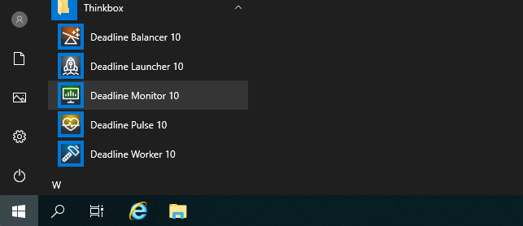
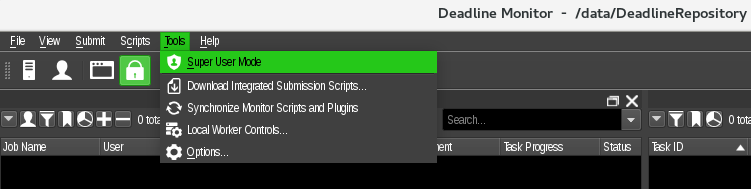
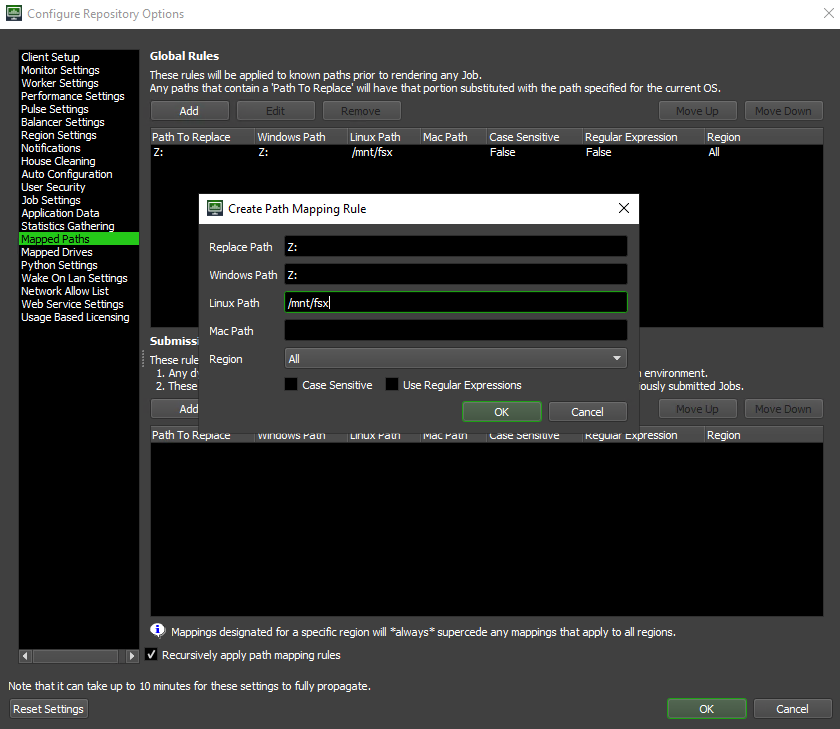
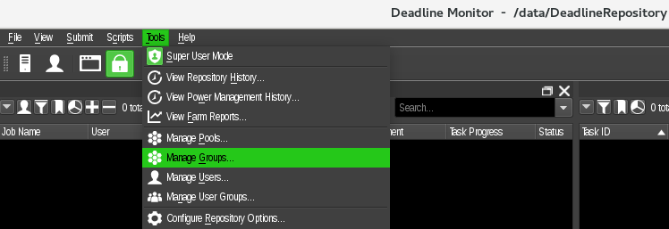
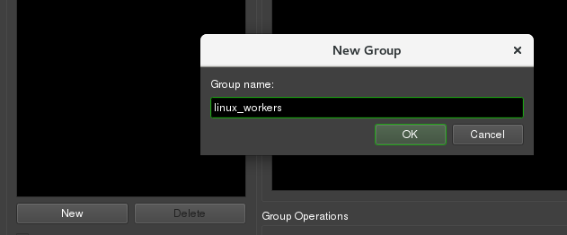
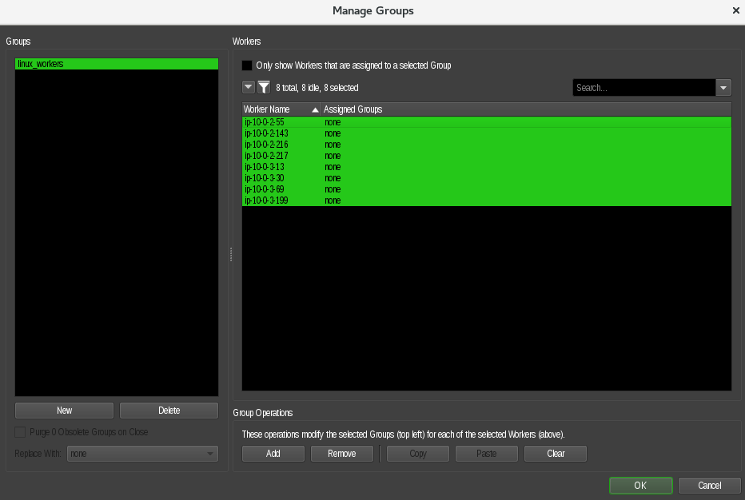
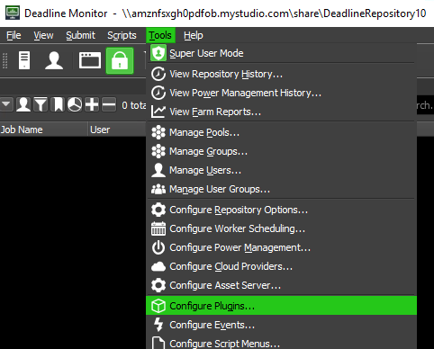
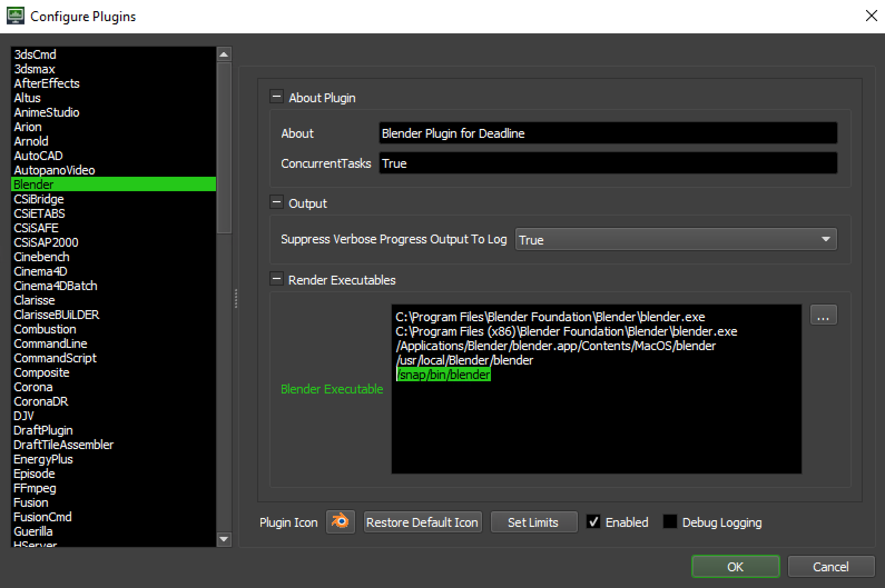

## Setup Deadline Monitor
The [Deadline Monitor](https://www.awsthinkbox.com/blog/deadline-monitor-interface-customization) is your main entry point for overseeing and managing your render farm. It's a powerful application that allows you to view, configure, and interact with the many of the moving parts that make up Deadline.

#### Launch the Monitor

`Start -> Thinkbox -> Deadline Monitor 10`

#### Enable Super User Mode

`Tools -> Super User Mode`

#### Set Mapped Path
The set up is using Linux workers for rendering, hence we need to map file paths and convert them from Windows to Linux

`Tools -> Configure Repository Options`

1. Click on **Mapped Paths**
1. Under **Global Rules** click on **Add**
1. Replace Path: **Z:**
1. Windows Path: **Z:**
1. Linux Path: **/mnt/fsx**

   

#### Set up the workers group

`Tools -> Manage Groups`

1. Click on **New** to create a group.

1. Give the group name **linux_workers**

    

1. Select all the nodes desired with **CTR+A** and click on **Add**

    

1. Click **Ok**.

#### Configure Blender Executables

1. `Tools -> Configure Plugins`

   

1. Blender is installed via Snapd package manager. The Blender executable is located in `/snap/bin/blender`. Add it to the Render Executables.

   

Next step is to set up [Blender plug-in](../blender/blender.md).
